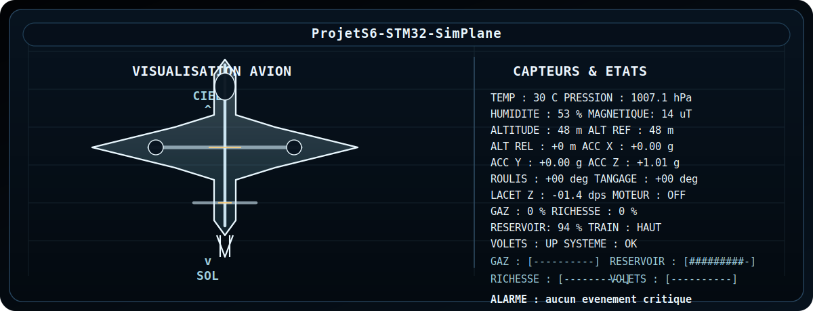
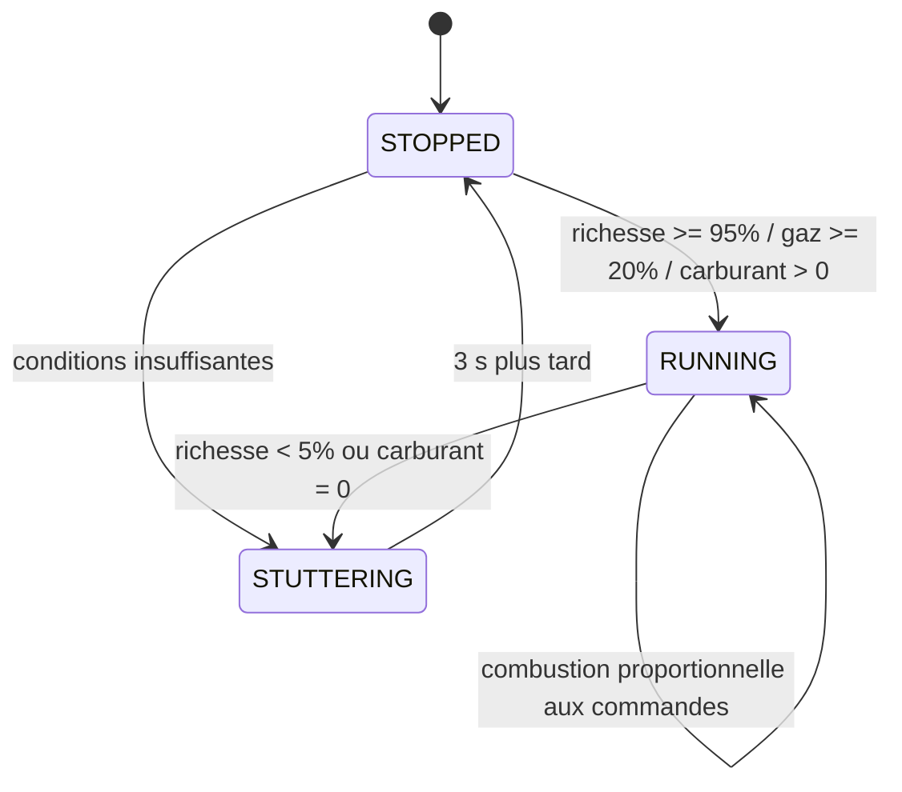

  
  
  
  
  

  

# ProjetS6-STM32-SimPlane

  <strong>Maquette d'avion miniature pilotee par STM32 avec capteurs MEMS, afficheur MAX7219, LEDs, buzzer PWM et console de diagnostic.</strong>

Ce projet reproduit le comportement grossier d'un avion miniature sur une
`NUCLEO-L152RE` associee a une shield `X-NUCLEO-IKS01A3` et a une carte
utilisateur type `ISEN32`. Le firmware lit plusieurs capteurs, pilote un
afficheur 7 segments `MAX7219`, une barre de 8 LEDs, un buzzer PWM, puis
simule des etats de vol, de carburant, de train et de volets.

> Important: par defaut, `APP_DISPLAY_DIAG_ONLY` vaut `1` dans
> [Core/Src/main.c](Core/Src/main.c). Dans cet etat, le firmware reste en
> boucle de diagnostic afficheur et ne lance pas la simulation complete.
> Passez cette constante a `0`, puis recompilez, pour activer l'avion complet.

## Sommaire

- [En bref](#en-bref)
- [Materiel et cartes](#materiel-et-cartes)
- [Cartographie des signaux](#cartographie-des-signaux)
- [Capteurs](#capteurs)
- [Peripheriques](#peripheriques)
- [Parametres importants](#parametres-importants)
- [Modes de fonctionnement](#modes-de-fonctionnement)
- [Commandes utilisateur](#commandes-utilisateur)
- [Moteur et carburant](#moteur-et-carburant)
- [Calibration et alerte POSE](#calibration-et-alerte-pose)
- [Priorite des sorties](#priorite-des-sorties)
- [Demarrage pas a pas](#demarrage-pas-a-pas)
- [Mode diagnostic afficheur](#mode-diagnostic-afficheur)
- [Architecture logicielle](#architecture-logicielle)
- [Fichiers clefs](#fichiers-clefs)
- [Build, flash et debug](#build-flash-et-debug)
- [Depannage rapide](#depannage-rapide)
- [FAQ](#faq)
- [Limites connues](#limites-connues)
- [Documentation de contexte](#documentation-de-contexte)
- [Licence](#licence)
- [Pour adapter le projet](#pour-adapter-le-projet)

## En bref

- Le projet met en scene un avion miniature entierement simule par logiciel.
- Les capteurs de la shield `IKS01A3` fournissent temperature, humidite,
  pression, champ magnetique et acceleration.
- Les potentiometres `RV1` et `RV2` servent de manette des gaz et de richesse.
- Les boutons `BTN1` a `BTN4` commandent le moteur, le train et les volets.
- Le bouton bleu `B1` de la NUCLEO change de mode ou se combine avec les
  boutons de la carte utilisateur pour gerer le carburant et le moteur.
- L'affichage 7 segments montre des messages courts ou defile des textes plus
  longs.
- La barre de LEDs sert de jauge et d'indicateur d'etat suivant le mode actif.
- Le buzzer PWM signale les demarrages, arrets, anomalies et l'etat `POSE`.
- Le code est volontairement simple: pas de RTOS, pas de threads, une super-loop
  cooperative basee sur `HAL_GetTick()`.

## Materiel et cartes

Le montage repose sur les elements suivants:

- `STM32 NUCLEO-L152RE`
- `X-NUCLEO-IKS01A3`
- une carte utilisateur type `ISEN32` avec:
  - 4 boutons (`BTN1` a `BTN4`)
  - 8 LEDs (`L0` a `L7`)
  - 2 potentiometres (`RV1` et `RV2`)
  - un buzzer
- un afficheur 7 segments `MAX7219`
- un cable de debug `ST-LINK` / port serie pour la console

## Cartographie des signaux

| Signal | Broche STM32 | Peripherique | Usage |
| --- | --- | --- | --- |
| `B1` | `PC13` | `GPIO/EXTI` | bouton bleu NUCLEO, changement de mode |
| `RV1` | `PA0` | `ADC1_IN0` | manette des gaz |
| `RV2` | `PA1` | `ADC1_IN1` | richesse |
| `BTN1` | `PA11` | `GPIO/EXTI` | bouton action, volets ou moteur |
| `BTN2` | `PA12` | `GPIO/EXTI` | bouton action, train ou carburant |
| `BTN3` | `PC6` | `GPIO/EXTI` | volets vers le bas |
| `BTN4` | `PC5` | `GPIO/EXTI` | train vers le bas |
| `L0` | `PB1` | `GPIO` | barre de niveau |
| `L1` | `PB2` | `GPIO` | barre de niveau |
| `L2` | `PB10` | `GPIO` | barre de niveau |
| `L3` | `PB11` | `GPIO` | barre de niveau |
| `L4` | `PB12` | `GPIO` | barre de niveau |
| `L5` | `PB13` | `GPIO` | barre de niveau |
| `L6` | `PB14` | `GPIO` | barre de niveau |
| `L7` | `PB15` | `GPIO` | barre de niveau / low fuel |
| `SPI1_SCK` | `PA5` | `SPI1` | horloge du MAX7219 |
| `SPI1_MOSI` | `PA7` | `SPI1` | donnees vers le MAX7219 |
| `SPI_CS` | `PA8` | `GPIO` | chip select du MAX7219 |
| `I2C1_SCL` | `PB8` | `I2C1` | liaison shield IKS01A3 |
| `I2C1_SDA` | `PB9` | `I2C1` | liaison shield IKS01A3 |
| `TIM3_CH1` | `PB4` | `PWM` | buzzer |
| `USART2_TX` | `PA2` | `USART2` | console de debug |
| `USART2_RX` | `PA3` | `USART2` | console de debug |

Note: `PA6` est configure comme `MISO` dans CubeMX pour `SPI1`, mais il n'est
pas exploite fonctionnellement par le driver `MAX7219`.

## Capteurs

Le firmware essaie d'initialiser tous les capteurs disponibles sur la shield et
continue en mode degrade si l'un d'eux est absent.

| Capteur | Donnees | Usage dans l'application | Notes |
| --- | --- | --- | --- |
| `LSM6DSO` | accelerometre + gyroscope | accelerometre principal pour la detection de pose | le gyroscope est initialise mais n'est pas consomme par la logique actuelle |
| `LIS2DW12` | accelerometre | secours si `LSM6DSO` accel ne repond pas | meme role de pose que `LSM6DSO` |
| `LIS2MDL` | magnetometre | mode 3 et jauge magnetique | valeur affichee sous forme approximative |
| `HTS221` | temperature + humidite | source prioritaire pour la temperature et la lecture humidite | capteur prefere si present |
| `LPS22HH` | pression + temperature | source pression et temperature de secours | la pression est utilisee pour l'alerte `POSE` |
| `STTS751` | temperature | temperature de secours | utilise seulement si `HTS221` est absent |

Ordre de priorite de la temperature:

1. `HTS221`
2. `STTS751`
3. `LPS22HH`

La pression provient de `LPS22HH` si le capteur est present. La detection de
champ magnetique se fait a partir d'une moyenne des valeurs absolues des axes.
L'humidite est bornee entre `0` et `100%`. Les valeurs affichees sont
arrondies a l'entier le plus proche.

Au demarrage, le firmware scanne aussi le bus `I2C1` sur les adresses `0x08`
a `0x77` et affiche les devices trouves. Les adresses typiques de la shield
`IKS01A3` sont `0x19`, `0x1E`, `0x4A`, `0x5D`, `0x5F` et `0x6B`.

## Peripheriques

| Peripherique | Configuration utile | Role |
| --- | --- | --- |
| `GPIO` | sorties LEDs, chip select SPI, entrees boutons | interface physique de la carte |
| `EXTI` / `NVIC` | interruptions sur front montant, debounce logiciel de 80 ms | prise en compte des boutons |
| `ADC1` | conversion 12 bits, scan sur 2 voies, lancement logiciel | lecture des potentiometres |
| `I2C1` | 100 kHz, PB8/PB9, open-drain avec pull-up | communication avec la shield `IKS01A3` |
| `SPI1` | master 8 bits, CPOL low, CPHA 1 edge, prescaler 16 | pilotage du `MAX7219` |
| `TIM3` | PWM sur `CH1`, frequence reprogrammee dynamiquement | buzzer |
| `TIM6` | interruption periodique d'environ 1 s | heartbeat / base de temps |
| `USART2` | `115200 8N1` | traces de boot, debug et `printf` |

La frequence systeme du MCU est de `32 MHz` avec l'HSI et la PLL
(`x6 / div3`). C'est cette horloge qui sert de base aux temporisations du
projet.

## Parametres importants

Les constantes suivantes sont definies en tete de
[Core/Src/main.c](Core/Src/main.c) et pilotent le comportement du projet.

### Temporisations

| Constante | Valeur | Effet |
| --- | --- | --- |
| `APP_ADC_PERIOD_MS` | `50 ms` | lecture des potentiometres |
| `APP_SENSOR_PERIOD_MS` | `200 ms` | lecture des capteurs |
| `APP_DISPLAY_PERIOD_MS` | `80 ms` | rafraichissement du MAX7219 |
| `APP_SCROLL_PERIOD_MS` | `300 ms` | deplacement du texte defilant |
| `APP_MESSAGE_MS` | `1800 ms` | duree des messages temporaires |
| `APP_MODE_PULSE_MS` | `1000 ms` | LED du mode lors d'un changement |
| `APP_SELF_TEST_MS` | `2000 ms` | duree de l'auto-test de sortie |
| `APP_ENGINE_STOP_DELAY_MS` | `3000 ms` | duree du mode `BROUT` avant arret |
| `APP_LOW_FUEL_STUTTER_MS` | `650 ms` | duree d'une saccade faible carburant |
| `APP_DEBOUNCE_MS` | `80 ms` | anti-rebond logiciel des boutons |

### Seuils et echelles

| Constante | Valeur | Effet |
| --- | --- | --- |
| `APP_MODE_COUNT` | `8` | nombre total de modes |
| `APP_FUEL_MAX_PERMILLE` | `1000` | reservoir plein |
| `APP_FUEL_LOW_PERMILLE` | `100` | seuil de carburant faible |
| `APP_FUEL_STEP_PERMILLE` | `100` | pas normal de carburant, soit 10% |
| `APP_FUEL_FINE_STEP_PERMILLE` | `10` | pas fin sous les 10%, soit 1% |
| `APP_INERTIAL_DELTA_MG` | `180` | seuil acceleration pour `POSE` |
| `APP_PRESSURE_LIFT_DELTA_HPA` | `0.70` | seuil pression pour `POSE` |
| `APP_NORMAL_BRIGHTNESS` | `8` | luminosite normale du MAX7219 |
| `APP_FULL_BRIGHTNESS` | `15` | luminosite maximale du MAX7219 |
| `APP_DISPLAY_DIAG_ONLY` | `1` | mode diagnostic afficheur par defaut |
| `APP_DISPLAY_REVERSE_DIGITS` | `0` | inverse l'ordre des digits si besoin |

## Modes de fonctionnement

Le bouton bleu `B1` de la NUCLEO fait defiler les 8 modes. A chaque changement,
la LED associee au mode s'allume pendant environ 1 seconde.

| Mode | Affichage 7 segments | LED associee | Utilite |
| --- | --- | --- | --- |
| `1` | `TMP=xxC` | `L0` | temperature ambiante |
| `2` | `PRES=xxxxHPA` | `L1` | pression atmospherique |
| `3` | `MAG=xxxx` | `L2` | champ magnetique + jauge 0 a 8 LEDs |
| `4` | `HUMI=xxPC` | `L3` | humidite + jauge 0 a 8 LEDs |
| `5` | `RESERVE=xxPC` | `L4` | niveau de carburant + jauge 0 a 8 LEDs |
| `6` | `BAS` / `HAUT` | `L5` | etat du train |
| `7` | `UP` / `MID` / `DOWN` | `L6` | etat des volets |
| `8` | `ISEN` | `L7` | respiration de luminosite du MAX7219 |

Notes utiles:

- Les textes plus longs que 8 caracteres defilent sur l'afficheur.
- Le mode 3 traduit la grandeur magnetique en un niveau approximatif.
- Le mode 4 et le mode 5 utilisent une jauge lineaire de 0 a 8 LEDs.
- Le mode 6 allume toutes les LEDs si le train est en bas.
- Le mode 7 utilise 0 LED pour `UP`, 4 LEDs pour `MID` et 8 LEDs pour `DOWN`.
- Le mode 8 fait varier la luminosite entre 2 et 15 pour un effet de respiration.

## Commandes utilisateur

Les boutons sont captes par interruptions `EXTI` avec debounce logiciel. Le
tableau ci-dessous resume le comportement reel du firmware.

| Combinaison | Action | Message / effet |
| --- | --- | --- |
| `B1` seul | passe au mode suivant | LED du mode pulse 1 s |
| `B1 + BTN1` avec moteur stoppe | tente le demarrage moteur | `START` ou `BROUT` |
| `B1 + BTN1` avec moteur en marche | baisse le carburant | `RES=xxPC` |
| `B1 + BTN2` | augmente le carburant | `RES=xxPC` |
| `BTN4` | train en position basse | `BAS` |
| `BTN2` | train en position haute | `HAUT` |
| `BTN3` | volets vers le bas | `MID` puis `DOWN` selon l'etat courant |
| `BTN1` | volets vers le haut | `MID` puis `UP` selon l'etat courant |

Regles a retenir:

- `BTN1` et `BTN2` appartiennent a la carte utilisateur, pas a la NUCLEO.
- Quand `B1` est maintenu, les combos carburant/moteur priment sur le changement
  de mode.
- Un appui court sur `B1` sans combo fait simplement passer au mode suivant.
- Le systeme est volutivement tolerant aux appuis rapides grace au debounce de
  80 ms.

## Moteur et carburant

Le moteur virtuel est gere par une petite machine a etats:

### Conditions de demarrage

- la richesse doit etre au moins a `95%`;
- la manette des gaz doit etre au moins a `20%`;
- le reservoir ne doit pas etre vide.

Si ces conditions sont remplies:

- le moteur passe a l'etat `RUNNING`;
- le message `START` est affiche;
- un bip a `1200 Hz` pendant `250 ms` est emis;
- la consommation de carburant commence;
- une future saccade de faible carburant est planifiee aleatoirement entre
  `2 s` et `5 s`.

Si les conditions ne sont pas remplies:

- le moteur passe a l'etat `STUTTERING`;
- le message `BROUT` est affiche;
- un bip a `600 Hz` pendant `250 ms` est emis;
- le moteur s'arrete ensuite au bout de `3 s` avec le message `STOP`.

### Fonctionnement en marche

- la frequence sonore du moteur est calculee par `180 + 8 * gaz + 5 * richesse`;
- cette frequence est plafonnee a `1800 Hz`;
- la consommation de carburant augmente avec `gaz x richesse`;
- quand le reservoir tombe a `10%` ou moins, le moteur peut brouter de facon
  aleatoire toutes les `2 a 5 s`;
- en dessous de `10%`, la LED `L7` clignote de plus en plus vite;
- a `0%`, le moteur s'arrete immediatement avec `STOP`.

### Ajustement du carburant

- `B1 + BTN2` augmente le reservoir par pas de `10%`;
- `B1 + BTN1` le baisse par pas de `10%`;
- quand le reservoir est a `10%` ou moins, la baisse se fait par pas de `1%`;
- chaque variation affiche `RES=xxPC` pendant `1800 ms`.

Le carburant est stocke en interne en `permille` entre `0` et `1000`.

## Calibration et alerte POSE

Au demarrage, le firmware mesure une reference inertielle et une reference de
pression afin de detecter plus tard si la carte est levee alors que le moteur
est a l'arret.

### Calibration

- 8 echantillons sont lus;
- chaque echantillon est espace de `40 ms`;
- les accelerations de reference sont moyennes sur les echantillons valides;
- la pression de reference est moyenne sur les echantillons valides;
- la calibration est consideree active si au moins une reference valide est
  obtenue.

### Declenchement de `POSE`

L'alerte est levee quand le moteur est stoppe et que l'une des conditions
suivantes est vraie:

- ecart d'acceleration superieur a `180 mg` sur au moins un axe;
- baisse de pression superieure a `0.70 hPa` par rapport a la reference.

### Effet de `POSE`

- l'affichage clignote sur `POSE`;
- la luminosite passe a `15`;
- le buzzer alterne entre `1500 Hz` et silence toutes les `250 ms`;
- l'affichage et le buzzer de `POSE` ont priorite sur le reste;
- l'alerte cesse quand la carte revient proche de la position de reference.

## Priorite des sorties

Le projet applique des priorites simples pour eviter les comportements ambigus.

| Sortie | Priorite haute | Priorite normale | Priorite basse |
| --- | --- | --- | --- |
| Afficheur 7 segments | `POSE` | message temporaire | texte du mode |
| LEDs | pulse de mode ou etat critique | jauge du mode | eteint |
| Buzzer | bip ponctuel | `POSE` | moteur en marche / silence |

Detail important:

- un message temporaire remplace le texte du mode pendant `1800 ms`;
- la barre de LEDs continue de representer le mode courant;
- `POSE` force la luminosite max et prend la main sur l'affichage;
- la LED `L7` peut aussi servir d'indicateur low fuel pendant la marche.

## Demarrage pas a pas

### Mode complet

1. `HAL_Init()` et configuration de l'horloge systeme.
2. Initialisation de `GPIO`, `USART2`, `ADC1`, `SPI1`, `TIM3` et `TIM6`.
3. Initialisation du `MAX7219`.
4. Auto-test:
   - LEDs allumees;
   - test afficheur;
   - buzzer actif pendant `2 s`.
5. Recuperation logique du bus `I2C1`.
6. Scan des adresses I2C presentes.
7. Initialisation des capteurs `IKS01A3`.
8. Lecture initiale de `ADC1` et des capteurs.
9. Calibration inertielle.
10. Affichage de `ISEN`.
11. Entree dans la super-loop applicative.

### Mode diagnostic afficheur

Si `APP_DISPLAY_DIAG_ONLY = 1`:

1. le `MAX7219` est initialise;
2. `88888888` est affiche pendant `2 s`;
3. `ISEN` est affiche pendant `2 s`;
4. la boucle alterne `ISEN`, `12345678` et un texte defilant de test.

Ce mode est pratique pour valider le cablage du `MAX7219` sans brancher toute
la partie avion.

## Architecture logicielle

Le comportement applicatif principal est concentre dans
[Core/Src/main.c](Core/Src/main.c). Le projet n'utilise pas de RTOS; tout est
gere par une boucle cooperative.

### Taches periodiques

| Tache | Periodicite | Role |
| --- | --- | --- |
| `APP_ReadAdc()` | `50 ms` | lit `RV1` et `RV2` |
| `APP_ReadSensors()` | `200 ms` | met a jour temperature, pression, humidite, magnetisme et accel |
| `APP_DisplayTask()` | `80 ms` | met a jour le MAX7219 |
| `APP_OutputTask()` | `80 ms` | pilote les LEDs |
| `APP_BuzzerTask()` | `80 ms` | pilote le buzzer |
| boucle principale | `5 ms` de pause | laisse respirer le systeme |
| `TIM6` | environ `1 s` | heartbeat / flag interne |

### Evenements asynchrones

- `HAL_GPIO_EXTI_Callback()` recupere les boutons.
- `HAL_TIM_PeriodElapsedCallback()` marque le tick `TIM6`.
- `__io_putchar()` redirige `printf` vers `ITM` et `USART2` quand c'est
  disponible.

### Fichiers cibles du comportement

| Fichier | Contenu |
| --- | --- |
| [Core/Src/main.c](Core/Src/main.c) | logique avion, machine a etats, affichage, moteur, buzzer |
| [Core/Inc/main.h](Core/Inc/main.h) | broches et definitions de carte |
| [Drivers/display/max7219_Yncrea2.c](Drivers/display/max7219_Yncrea2.c) | driver 7 segments |
| [Core/Src/stm32l1xx_nucleo_bus.c](Core/Src/stm32l1xx_nucleo_bus.c) | couche bus I2C et recuperation |
| [Plane_Project.ioc](Plane_Project.ioc) | configuration CubeMX |

## Fichiers clefs

| Fichier | Pourquoi il compte |
| --- | --- |
| [README.md](README.md) | vue d'ensemble du projet et guide d'utilisation |
| [Core/Src/main.c](Core/Src/main.c) | toute la logique applicative |
| [Core/Inc/main.h](Core/Inc/main.h) | cartographie exacte des broches |
| [Drivers/display/max7219_Yncrea2.c](Drivers/display/max7219_Yncrea2.c) | ecriture du texte sur l'afficheur 7 segments |
| [Core/Src/stm32l1xx_nucleo_bus.c](Core/Src/stm32l1xx_nucleo_bus.c) | init et scan I2C de la shield |
| [Plane_Project.ioc](Plane_Project.ioc) | source de la configuration CubeMX |
| [ContexteSTM32/cahier_des_charges.txt](ContexteSTM32/cahier_des_charges.txt) | spec de depart du projet |

## Build, flash et debug

### Prerequis

- `STM32CubeIDE 6.16.1` ou compatible
- `STM32Cube FW_L1 V1.10.6`
- `X-CUBE-MEMS1 11.3.0`
- une `NUCLEO-L152RE` reliee en `ST-LINK`

### Construction

1. Ouvrir le projet dans `STM32CubeIDE`.
2. Verifier que le workspace pointe bien sur `Plane_Project`.
3. Lancer un build `Debug` ou `Release`.
4. Flasher la carte via `ST-LINK`.
5. Ouvrir la console serie sur `USART2` en `115200 8N1` si vous voulez suivre
   les traces.

### Point important de configuration

- Pour valider seulement l'afficheur, laisser `APP_DISPLAY_DIAG_ONLY = 1`.
- Pour lancer la simulation avion, mettre `APP_DISPLAY_DIAG_ONLY = 0`.
- Si l'ordre des digits est inverse sur votre montage, passer
  `APP_DISPLAY_REVERSE_DIGITS = 1`.

### Traces de debug

Le firmware imprime:

- l'etat du scan I2C;
- le resultat d'initialisation de chaque capteur;
- les messages `START`, `BROUT`, `STOP`, `BAS`, `HAUT`, `UP`, `MID`, `DOWN`;
- les messages de diagnostic de l'afficheur.

## Depannage rapide

| Symptom | Cause probable | Action |
| --- | --- | --- |
| Le projet reste sur `ISEN` ou `12345678` | `APP_DISPLAY_DIAG_ONLY` est encore a `1` | mettre `APP_DISPLAY_DIAG_ONLY = 0` puis recompiler |
| L'afficheur est vide | `SPI1`, `CS`, ou MAX7219 mal cable | verifier `PA5`, `PA7`, `PA8` et l'alimentation |
| Aucun capteur n'est detecte | shield mal enfoncee ou I2C bloque | verifier `PB8`, `PB9`, la tension et le montage |
| Les boutons ne repondent pas | front/EXTI ou cablage carte utilisateur | verifier `BTN1` a `BTN4` et la masse commune |
| Le moteur ne demarre jamais | gaz trop bas, richesse trop faible ou reservoir vide | respecter `gaz >= 20%`, `richesse >= 95%`, `carburant > 0` |
| `POSE` reste affiche | la carte est encore consideree hors reference | reposer la carte a sa position d'origine |
| Aucun bip ne sort | PWM `TIM3` ou buzzer non fonctionnel | verifier `PB4` et le demarrage PWM |
| Les LEDs ne correspondent pas au mode | carte ou fils inverses | controler le mapping `L0` a `L7` |

### Cas particulier du bus I2C

Si le bus `I2C1` est bloque, le firmware essaie d'abord une recuperation
logicielle:

- `SCL` et `SDA` sont remis en open-drain avec pull-up;
- la ligne `SCL` est pulsee plusieurs fois si `SDA` reste a 0;
- l'etat des lignes est affiche avant et apres recovery;
- le bus est ensuite reconfigure en `I2C1` normal.

## FAQ

Les questions ci-dessous sont celles qui peuvent facilement tomber a l'oral.
Les reponses sont courtes, factuelles, et directement liees au code.

1. Quel est l'objectif principal du projet ?

Simuler un avion miniature sur STM32 avec des capteurs, un afficheur 7 segments,
une barre de LEDs et un buzzer, pour reproduire un cockpit pedagogique.

2. Quel materiel compose le systeme ?

Une `NUCLEO-L152RE`, une `X-NUCLEO-IKS01A3`, une carte utilisateur type `ISEN32`,
un afficheur `MAX7219`, 8 LEDs, 4 boutons, 2 potentiometres et un buzzer.

3. Pourquoi avoir choisi une carte NUCLEO STM32 ?

Elle fournit assez de ressources pour gerer les capteurs, l'ADC, le SPI, l'I2C,
le PWM et les interruptions tout en restant simple a manipuler en TP.

4. Pourquoi utiliser la shield IKS01A3 ?

Parce qu'elle regroupe plusieurs capteurs utiles sur un seul module, ce qui
simplifie le cablage et permet de simuler plusieurs grandeurs physiques.

5. Pourquoi avoir pris un MAX7219 pour l'affichage ?

Il pilote directement un afficheur 7 segments avec peu de lignes, gere le
multiplexage et permet aussi le controle de la luminosite.

6. Pourquoi ne pas utiliser un RTOS ?

Le besoin reste simple. Une super-loop cooperative suffit et rend le code plus
facile a expliquer et a maintenir dans ce contexte.

7. Comment le programme est-il organise ?

Il y a une phase d'initialisation, puis une boucle principale qui appelle des
taches periodiques basees sur `HAL_GetTick()`.

8. A quoi sert `APP_DISPLAY_DIAG_ONLY` ?

C'est un mode de diagnostic qui teste uniquement l'afficheur. Quand il vaut `1`,
la simulation avion complete est desactivee.

9. Que fait le programme au demarrage en mode complet ?

Il initialise le HAL, les peripheriques, lance l'auto-test, scanne l'I2C,
initialise les capteurs, calibre l'inertie, puis affiche `ISEN`.

10. Pourquoi faire un auto-test au demarrage ?

Pour verifier rapidement que les LEDs, l'afficheur et le buzzer fonctionnent
avant d'entrer dans la logique de simulation.

11. Comment le code gere-t-il un bus I2C bloque ?

Il tente une recuperation logicielle du bus en relachant les lignes, en pulsant
`SCL` si besoin, puis en reinitialisant `I2C1`.

12. Quels capteurs sont utilises dans le projet ?

`LSM6DSO`, `LIS2DW12`, `LIS2MDL`, `HTS221`, `LPS22HH` et `STTS751`.

13. Quel capteur est prioritaire pour la temperature ?

`HTS221` en premier, puis `STTS751`, puis `LPS22HH` si les precedents ne sont
pas disponibles.

14. A quoi servent la pression et le magnetisme ?

La pression sert a l'alerte `POSE` et a l'affichage. Le magnetometre sert au
mode 3 et a une jauge approximative.

15. Comment sont lus les potentiometres ?

Via `ADC1` en scan sur deux voies. `RV1` sert a la manette des gaz et `RV2` a
la richesse.

16. Pourquoi utiliser des interruptions pour les boutons ?

Pour reagir immediatement aux appuis sans poller en permanence les entrees, tout
en gardant un anti-rebond logiciel.

17. Pourquoi vider les evenements bouton sous section critique ?

Pour lire et remettre a zero les flags de maniere atomique, sans course entre le
callback EXTI et la boucle principale.

18. A quoi sert le bouton bleu B1 de la NUCLEO ?

Seul, il change de mode. Combine a `BTN1` ou `BTN2`, il sert a gerer le moteur
ou le carburant.

19. A quoi servent BTN1, BTN2, BTN3 et BTN4 ?

`BTN1` monte les volets, `BTN2` remonte le train, `BTN3` baisse les volets et
`BTN4` baisse le train.

20. Comment les LEDs sont-elles utilisees ?

Elles forment une barre de niveau. Selon le mode, elles representent une valeur,
le train, les volets, ou un indicateur carburant faible.

21. Que fait le mode 1 ?

Il affiche la temperature ambiante au format `TMP=xxC` et pulse la LED `L0`.

22. Que fait le mode 2 ?

Il affiche la pression atmospherique au format `PRES=xxxxHPA` et pulse la LED
`L1`.

23. Que fait le mode 3 ?

Il affiche `MAG=xxxx` et transforme le magnetisme en jauge 0 a 8 LEDs. La LED
`L2` pulse a l'entree du mode.

24. Que fait le mode 4 ?

Il affiche l'humidite au format `HUMI=xxPC` et l'illustre avec la barre de
LEDs. La LED `L3` pulse.

25. Que fait le mode 5 ?

Il affiche le niveau de carburant et l'illustre avec la barre de LEDs. La LED
`L4` pulse.

26. Que fait le mode 6 ?

Il montre l'etat du train avec `BAS` ou `HAUT`. Quand le train est bas, toutes
les LEDs sont allumees.

27. Que fait le mode 7 ?

Il affiche l'etat des volets avec `UP`, `MID` ou `DOWN`. La barre de LEDs
vaut 0, 4 ou 8 selon la position.

28. Que fait le mode 8 ?

Il affiche `ISEN` avec une respiration de luminosite sur le MAX7219. La LED
`L7` pulse a l'entree du mode.

29. Quelles sont les conditions pour demarrer le moteur ?

Il faut une richesse d'au moins `95%`, une manette des gaz d'au moins `20%` et
du carburant disponible.

30. Que se passe-t-il si les conditions de demarrage ne sont pas reunies ?

Le moteur passe en mode `BROUT`, un message s'affiche, puis il s'arrete apres
environ `3 s` avec un bip et le message `STOP`.

31. Comment la consommation de carburant est-elle calculee ?

Le code utilise un accumulateur qui depend du temps ecoule, de la manette des
gaz et de la richesse. Quand le seuil est depasse, le carburant diminue.

32. Pourquoi stocker le carburant en permille ?

Pour avoir des pas de `10%` en regime normal et des pas fins de `1%` quand le
niveau devient faible.

33. Que se passe-t-il quand le carburant devient faible ?

Le moteur peut brouter de facon aleatoire toutes les `2` a `5 s`, et la LED
`L7` clignote de plus en plus vite.

34. Que se passe-t-il si le carburant tombe a 0% ?

Le moteur s'arrete immediatement, le message `STOP` est affiche et un bip de
fin est emis.

35. Comment l'alerte POSE est-elle detectee ?

Quand le moteur est stoppe, le firmware compare l'acceleration et la pression
actuelles a la reference calibree au demarrage. Si l'ecart depasse les seuils,
`POSE` est declenchee.

36. Pourquoi calibrer l'inertie au demarrage ?

Pour memoriser la position de reference de la carte et pouvoir detecter ensuite
si la maquette a ete levee de facon non realiste.

37. Comment le firmware gere-t-il l'affichage des messages ?

Un message temporaire a priorite pendant une duree donnee, puis le texte du mode
reprend. Si le texte depasse 8 caracteres, il defile.

38. Pourquoi avoir code un driver MAX7219 personnalise ?

Pour controler precisement l'allumage, la luminosite, le clear, le test
d'affichage et le jeu de caracteres supporte.

39. Quels caracteres l'afficheur supporte-t-il vraiment ?

Principalement les chiffres, plusieurs lettres utiles, l'espace, `-` et `=`.
Les caracteres non geres s'affichent comme des blancs.

40. A quoi servent TIM3, TIM6 et USART2 ?

`TIM3` genere le PWM du buzzer, `TIM6` sert de base de temps periodique et
`USART2` est utilise pour les `printf` de debug a `115200 8N1`.

## Limites connues

- Le moteur est simule par une logique pedagogique, pas par un modele physique.
- Le gyroscope `LSM6DSO` est initialise mais n'est pas encore exploite par la
  logique de vol.
- L'afficheur `MAX7219` ne supporte qu'un jeu de caracteres limite.
- Le jeu de caracteres couvre surtout `0-9`, `A-Z` partiel, espace, `-` et `=`;
  tout le reste ressort en blanc.
- Le projet tourne en super-loop, sans RTOS ni ordonnanceur preemptif.
- Les valeurs de magnetisme, de pression et de carburant sont avant tout des
  indicateurs de scenario.
- Le mode diagnostic peut masquer le vrai comportement si on oublie de le
  desactiver.

## Documentation de contexte

Le dossier [ContexteSTM32/](ContexteSTM32/) regroupe:

- le cahier des charges initial;
- les supports de cours GPIO, interruptions, timers, PWM, ADC, SPI et I2C;
- les documents STMicroelectronics sur la shield `IKS01A3`;
- des fiches techniques utiles pour rediger un rapport ou retrouver un detail.

Ces fichiers ne sont pas indispensables au build, mais ils sont tres utiles
pour comprendre le projet, l'expliquer et le maintenir.

## Licence

Le depot embarque des composants STMicroelectronics et des bibliotheques
tierces soumis a leurs licences respectives.

- Le code applicatif du projet peut recevoir la licence de votre choix.
- Les fichiers fournis par ST conservent leurs licences d'origine.
- Si vous souhaitez redistribuer ou publier plus largement le projet, ajoutez
  une licence explicite au depot.

## Pour adapter le projet

Si vous modifiez le hardware, les bons fichiers a toucher sont souvent:

- [Plane_Project.ioc](Plane_Project.ioc) pour la config CubeMX;
- [Core/Inc/main.h](Core/Inc/main.h) pour les broches;
- [Core/Src/main.c](Core/Src/main.c) pour les seuils, modes et messages;
- [Drivers/display/max7219_Yncrea2.c](Drivers/display/max7219_Yncrea2.c) pour
  la font ou le comportement du MAX7219.

Les constantes `APP_...` dans `Core/Src/main.c` sont les premiers points a
modifier si vous voulez changer:

- les vitesses de rafraichissement;
- les seuils moteur et carburant;
- le comportement de `POSE`;
- la luminosite de l'afficheur;
- les temporisations des messages.

Si vous voulez aller encore plus loin, les prochaines ameliorations evidentes
sont:

- ajouter un schema de cablage clair;
- ajouter un diagramme de mode avion;
- ajouter une version anglaise du README;
- documenter les signaux LED et boutons de la carte utilisateur en photo.
